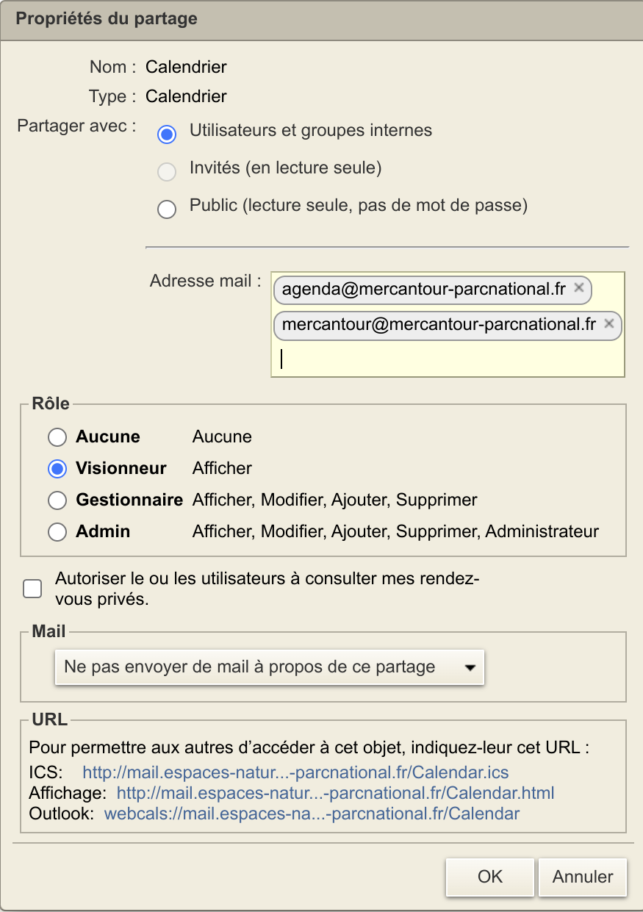
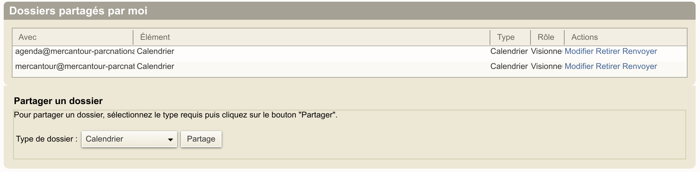
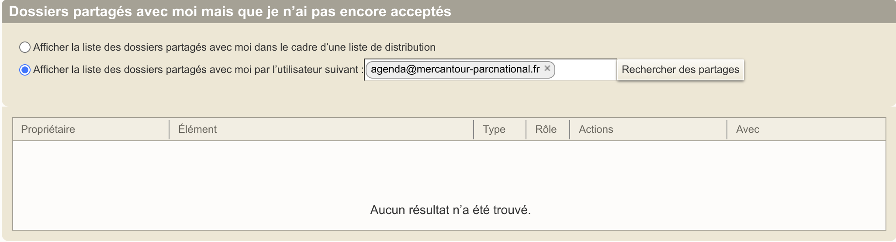

# Zimbra

Notre serveur de messagerie Zimbra permet de partager les agendas, les carnets d'adresses et les boîtes mail, collectivement appelés `dossiers` par Zimbra.  
Ce document explique comment [partager vos dossiers](#partager-son-agenda-son-carnet-dadresses-sa-boîte-mail) et comment [accéder aux dossiers partagés par un collègue](#accéder-à-un-agenda-un-carnet-dadresses-ou-une-boîte-mail-partagés-avec-moi).

Après avoir configuré Zimbra, vous pourrez simplement accéder aux partages depuis Thunderbird et les applications de messagerie/contacts/agenda de votre smartphone.

- Paramétrer [Thunderbird](../Thunderbird/README.md).
- Paramétrer votre [smartphone android](../android/README.md).

## Partager son agenda, son carnet d'adresses, sa boîte mail

Vous pouvez configurer le partage avec d'autres utilisateurs (ou listes d'utilisateurs) zimbra de votre boîte mail, de votre agenda ou de votre carnet d'adresses.

Le paramétrage des partages doit être réalisé dans l'appli web zimbra https://mail.espaces-naturels.fr/ :

- dans l'onglet `Préférences / Partage`,
- ou dans l'onglet `Mail, Contacts, Calendrier` en sélectionnant (clic droit) le calendrier, le carnet d'adresses ou le dossier de mail à partager.

### Gérer les partages actifs

L'onglet `Préférences / Partage / Dossiers partagés par moi` vous permet de contrôler les partages actifs, de modifier les droits ou de révoquer un partage.

### Partage à activer impérativement

Il est **nécessaire** de partager votre agenda avec agenda@mercantour-parcnational.fr en lui donnant le rôle de visionneur. Ce partage permet à l'application http://agenda.mercantour.local (sur le réseau interne) d'accéder à votre agenda et de le visualiser sous une forme expurgée (le détail des évènements reste masqué).  
Par défaut, vos rendez-vous privés ne sont pas consultables.

### Partages optionnels

Vous pouvez partager votre agenda avec des utilisateurs identifiés, avec des groupes d'utilisateurs (par exemple la liste de diffusion de votre service) ou avec tous les collègues (partage avec la liste de diffusion générale mercantour@mercantour-parcnational.fr ).  
Vous pouvez également partager un carnet d'adresses ou une boîte mail en suivant la même procédure.

Pour chaque partage, vous devez préciser le rôle attribué au collègue avec qui vous partagez vos dossiers: visionneur ou gestionnaire.
Ces partages ciblés vont permettre à vos collègues d'accéder de façon sécurisée en se connectant avec leur identifiant (et leur mot de passe) à vos dossiers depuis n'importe laquelle de leurs applications de messagerie/agenda/carnet d'adresses : zimbra web, thunderbird sur PC, mail, contacts et agenda sur smartphone.

### Partages à désactiver impérativement

**Supprimer les partages avec public**. N'importe qui sur Internet pourrait voir vos agendas, la liste de vos interlocuteurs, les mots de passe de connexion aux visioconférences, les informations confidentielles contenues dans les évènements.

## Accéder à un agenda, un carnet d'adresses ou une boîte mail partagés avec moi

Un collègue a partagé avec vous son agenda, son carnet d'adresses ou sa boîte mail.  
Voici comment y accéder.

Vous **devez** accepter le partage dans l'appli web zimbra https://mail.espaces-naturels.fr/ pour que ce partage soit automatiquement détecté par vos applications de messagerie/calendrier.

### Accepter un partage depuis l'onglet Préférences

Ouvrez l'onglet `Préférences / Partage` ou vous trouverez la section `Dossiers partagés avec moi mais que je n'ai pas encore acceptés` et celle des `Dossiers partagés et déjà acceptés`

Vous verrez les dossiers partagés avec vous `dans le cadre d'une liste de distribution`.

- N'acceptez que les dossiers que vous voulez voir apparaître dans zimbra et sur votre mobile, c'est dire ceux des collègues avec lesquels vous interagissez très régulièrement.
- Pensez que l'application http://agenda.mercantour.local vous permet de consulter occasionnellement les autres agendas.
- Pensez également que thunderbird intègre un outil de planification de réunion qui connaît la disponibilité de chaque agent.

Vous verrez également les `dossiers partagés avec vous par un utilisateur spécifique` en utilisant le formulaire de recherche (entrez le nom de votre collègue). En toute logique, vous accepterez ce partage.

La section des `Dossiers partagés et déjà acceptés` vous permet de visualiser l'ensemble des dossiers partagés ajoutés à votre compte Zimbra. Pour renoncer à un partage déjà accepté et qui ne vous intéresse plus, voir [ci-dessous](#accepter-un-partage-depuis-longlet-calendrier-mail-contacts).

### Accepter ou renoncer à un partage depuis l'onglet Calendrier, Mail, Contacts

Vous pouvez également rechercher un partage à partir de l'onglet `Mail, Contacts, Calendrier` en cliquant sur la petite roue des options en haut à gauche de la liste des dossiers, puis `Rechercher des partages`.

Pour ne plus voir un dossier partagé avec vous, il suffit de faire un clic droit sur le dossier et de cliquer sur Supprimer.

### Partages utiles

Il est important d'accepter l'invitation de partage du carnet d'adresses `Contacts` de `agents@mercantour-parcnational.fr`. Ce carnet d'adresses géré par le SI contient les contacts de l'ensemble des agents, il vous servira en particulier à déterminer qui vous appelle sur votre mobile et à compléter automatiquement les adresses de vos destinataires (une fonctionnalité qui existait avec Exchange, mais limitée à la liste d'adresses globale de Zimbra, excluant les carnets d'adresse partagés).

Vous pouvez également importer l'agenda commun du Parc, partagé par `agenda@mercantour-parcnational.fr`.

Certains services ont mis en place des agendas partagés, des carnets d'adresse partagés de contacts externes, usez et abusez de ces sources d'information.

### Paramétrage des contacts

- Laisser cochée l'option Préférences / Calendrier / Autorisations / Libre/Occupé à sa valeur par défaut (autoriser tous les utilisateurs). Cela permettra à vos interlocuteurs de déterminer si vous êtes disponibles lorsqu'ils planifient un évènement.
