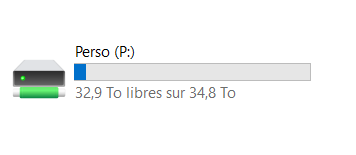

# Stocker ses documents

## Stocker ses documents dans un espace personnel réservé à soi
Le disque Perso (P:) est désormais disponible pour vous 🗂️

Chaque agent dispose maintenant de son propre espace Perso (P:), stocké sur un serveur de stockage local (un par site) .

Cet espace vous est strictement personnel : les documents que vous y déposez ne sont accessibles qu’à vous. Vous pouvez donc l’utiliser pour conserver vos fichiers de travail, documents, notes ou tout autre contenu dont vous avez besoin sans avoir à le partager à la vue de tous.