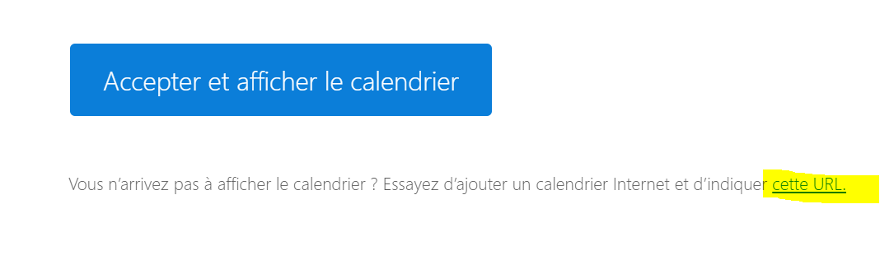
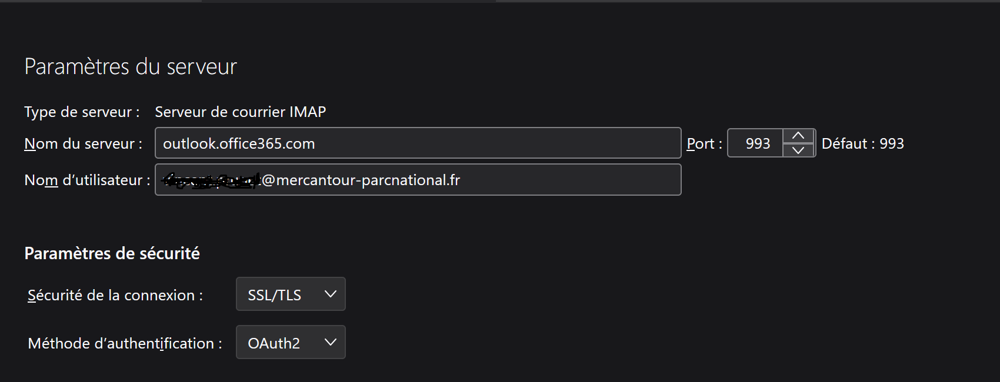

# Outils de messagerie, carnets d'adresse, agendas partagés, signatures, services Zoom au Parc National du Mercantour

Ce document explique comment configurer et utiliser Outlook et Zoom.

Pour plus d'information, accédez à la documentation en ligne des outils en interrogeant votre navigateur web ... ou demandez au SI.

Vous trouverez également des modules de formation pour vous accompagner dans la migration vers Microsoft 365 sur le micro site [https://migration365.mercantour.local](https://migration365.mercantour.local)

Notez que l'application web d'agenda partagé [https://agenda.mercantour.local](https://agenda.mercantour.local) n'est plus en service.
Pour en savoir plus sur la suppression de cette application: l'[application agenda](./agenda_mercantour_local.md)

## A propos d'Outlook
Outlook est le nom générique des applications que vous utilisez pour gérer votre courrier, vos agendas et vos contacts.  
Ces applications interagissent avec votre compte Exchange online, qui remplace zimbra.

Si vous avez un compte mail sous la forme `prenom.nom@mercantour-parcnational.fr`, vous pouvez utiliser Outlook pour le web (sur PC ou mobile) à l'adresse [https://outlook.office.com/](https://outlook.office.com/mail/). Vous pouvez également installer et utiliser l'application Outlook sur votre mobile (à télécharger dans le play store android, ou l'app store Apple).

Selon la licence d'utilisation qui vous est attribuée, vous pouvez dans certains cas avoir accès à la suite office sur votre PC (ou mac). Dans ce cas, vous pouvez utiliser Outlook pour Windows (ou Outlook for macos) sur votre PC. Merci d'utiliser impérativement la version Outlook (new) de préférence à la version Outlook (classic) qui sera bientôt arrêtée par l'éditeur.

Les agents permanents ont (ou auront) accès à la suite office sur PC et auront le choix d'utiliser le client lourd Outlook (new).  
Les agents saisonniers doivent utiliser Outlook pour le web ou Outlook mobile. Leur licence Microsoft 365 ne permet pas d'utiliser Outlook pour Windows.

Pour tous, __Outlook pour le web est l'application recommandée par le SI__.

[Installer Outlook sur votre mobile](https://migration365.mercantour.local/files/installoutlookmobile.pdf)

## Configuration d'Outlook

### Outlook pour le web
Pour utiliser Outlook pour le web, il suffit de vous connecter à votre compte Microsoft 365 avec votre adresse email professionnelle comme identifiant et votre mot de passe Windows comme mot de passe.

https://m365.cloud.microsoft

Accédez aux applications par le lanceur d'applications (en haut à gauche de l'écran), sélectionnez Outlook.

Pour accéder directement à Outlook, suivez le lien [https://outlook.office.com/mail/](https://outlook.office.com/mail/)

[Connexion à Outlook pour le web](https://migration365.mercantour.local/files/webmail_outlook_connection.pdf)

### Configuration d'Outlook pour Windows
[Configurer et utiliser Outlook](https://support.microsoft.com/fr-fr/office/configurer-et-utiliser-outlook-4636f361-d5e3-4a87-9cd4-382858de55fa)

## Boîtes partagées
Les boîtes partagées permettent à un groupe d'agents de gérer conjointement un service rendu par messagerie (accueil, autorisations, etc).
Lorsque vous avez accès à une boîte partagée (voir votre responsable de service), vous pouvez vous connecter [ainsi](https://migration365.mercantour.local/files/webmail_outlook_boites_partagees.pdf).

Voir également:

- la documentation de Microsoft sur l'[utilisation des boîtes partagées dans Outlook](https://support.microsoft.com/fr-fr/office/ouvrir-et-utiliser-une-bo%C3%AEte-aux-lettres-partag%C3%A9e-dans-outlook-d94a8e9e-21f1-4240-808b-de9c9c088afd?WT.mc_id=365AdminCSH_inproduct), 
- [la liste des boîtes partagées du Parc](https://migration365.mercantour.local/shared_mailboxes.html),
- [la liste des délégations de boîtes du Parc](https://migration365.mercantour.local/mail_delegates.html).

## Partage d'agenda
- Comment afficher un calendrier perso dans outlook à côté de mon calendrier pro?
- Comment afficher mon agenda pro dans mon application calendrier perso?
- Comment partager mon agenda avec mes collègues?
- Comment afficher un agenda partagé par un collègue?
### Intégrer un calendrier perso dans Outlook
Procédure testée à partir d'un agenda google, à adapter à votre application agenda perso.

[Afficher un calendrier google dans Outlook](https://support.microsoft.com/fr-fr/office/afficher-votre-calendrier-google-dans-outlook-c1dab514-0ad4-4811-824a-7d02c5e77126)

Remarques:

- Pour  afficher le volet de navigation de l'application calendrier, ouvrir la barre latérale à gauche du bouton Accueil (logo 3 bandes).
- Fonctionne avec Outlook (new) et Outlook web.
- Le paramétrage (liste des calendriers, code couleur) est enregistré dans le cloud. Il est propagé automatiquement sur toutes les applications (outlook PC, outlook web, outlook mobile) lorsqu'elles redémarrent. Seul l'affichage (oui/non) doit être configuré séparément sur chaque application cliente.
- Le SI ne contrôle pas le paramétrage global sur le serveur Exchange (mis en oeuvre par l'OFB) et ne peut garantir que la fonctionnalité d'intégration de calendrier sera toujours disponible.

### Voir son agenda pro dans une application calendrier perso

 Il est possible de partager son agenda pro avec vous-même (adresse perso) de façon à l'afficher dans votre appli d'agenda perso à côté de vos autres évènements.

[Partager votre calendrier dans Outlook sur le web](https://support.microsoft.com/fr-fr/office/partager-votre-calendrier-dans-outlook-sur-le-web-7ecef8ae-139c-40d9-bae2-a23977ee58d5)

Remarques:

- Pour importer ce calendrier dans google agenda ou icloud, créer un calendrier à partir du lien ICS donné dans le mail contenant l'invitation.

- Les calendriers partagés via un lien ICS sont en lecture seule dans l'application cliente.
- Ne jamais partager les détails des évènements avec des personnes non habilitées pour d'évidentes raisons de confidentialité.

### Partager mon agenda avec les collègues ou afficher un agenda partagé par un collègue

[Partager un calendrier dans Outlook](https://support.microsoft.com/fr-fr/office/partager-votre-calendrier-dans-outlook-2fcf4f4f-8d46-4d8b-ae79-5d94549e531b)

## Configuration et génération de la signature

Pour configurer sa signature et apprendre comment l'utiliser avec Outlook, rendez-vous sur la page [https://signature.mercantour.local/](https://signature.mercantour.local/)

[Créer et ajouter une signature électronique dans Outlook](https://support.microsoft.com/fr-fr/office/cr%C3%A9er-et-ajouter-une-signature-%C3%A9lectronique-dans-outlook-8ee5d4f4-68fd-464a-a1c1-0e1c80bb27f2#picktab=outlook_on_the_web)

## Message d'absence  

Ouvrir les paramètres Outlook. Aller dans Comptes / Réponses automatiques.

[Lien vers la documentation Outlook](https://support.microsoft.com/fr-fr/office/envoyer-des-r%C3%A9ponses-automatiques-absence-du-bureau-%C3%A0-partir-d-outlook-9742f476-5348-4f9f-997f-5e208513bd67#officeversion=web)

## Que deviennent Thunderbird et mes données?

Ancien utilisateur du client de messagerie Thunderbird, vous avez peut-être :

- des fichiers d'archive mail sur votre PC (ou sur le serveur local de votre service)
- des contacts et listes de diffusion enregistrés localement sur Thunderbird

Les données qui étaient sur le serveur Zimbra au moment de la migration vers Exchange ont été transférées sur le serveur Exchange.  
Par contre, les données qui étaient gérées localement par l'application Thunderbird n'ont pas été transférées sur Exchange.

Selon l'usage que vous en faites, les archives mail peuvent :

- être poussées sur le compte Exchange et être ainsi disponibles pour toute personne qui accède au compte (si la boîte est partagée) quel que soit le client Outlook utilisé, très intéressant pour faire des recherches dans les messages en incluant les archives.
- rester sous la forme de fichiers MBOX (format des archives Thunderbird) stockées sur votre PC (et sauvegardées par ailleurs). Il faut dans ce cas utiliser Thunderbird pour parcourir les archives. Traitement à réserver aux archives froides, celles qu'on n'ira probablement jamais consulter.

__IMPORTANT: Le mécanisme mis à notre disposition pour déplacer les archives sur le serveur Exchange est temporaire. A partir du mois de septembre, il ne sera plus possible de copier simplement les archives MBOX vers Exchange.__

### Supprimer le compte zimbra dans Thunderbird et dans le client de messagerie mobile android
Depuis la migration vers Exchange Online, le compte zimbra ne reçoit plus de mails et n'est plus synchronisé avec Exchange.  
Il est impératif de ne plus utiliser ce compte, au risque de perdre des messages.    
Pour en être sûr, supprimez le compte dans Thunderbird et dans votre client de messagerie mobile. Supprimez également les données du compte (mails et évènements mis en cache sur votre PC) pour libérer de l'espace disque sur votre PC. 

### Transférer des archives de courrier
Il est recommandé de transférer les archives de courrier (au moins celles que vous êtes susceptibles de consulter) depuis votre ou vos profils Thunderbird vers le ou les comptes Exchange correspondants.  

- Un jour où vous avez une bonne connexion internet ...
- Ouvrir le profil Thunderbird qui contient les dossiers locaux à transférer.
- Créer une connexion IMAP vers le serveur Exchange comme sur la copie d'écran ci-dessous.

- Seuls les dossiers Outlook auxquels vous êtes abonné (click droit sur le dossier racine et "S'abonner") sont visibles, mais ce n'est pas gênant.
- Déplacer les dossiers locaux (ou les messages d'intérêt) vers un dossier sur le serveur Exchange. 
- Il peut y avoir des erreurs (cela se produit lorsque Exchange essaie d'enregistrer un message avant d'avoir créé le dossier qui le contient). Dans ce cas, créer le ou les dossiers voulus sur le serveur exchange, puis retenter le déplacement des messages. 
- A la fin du traitement, les messages transférés doivent être lisibles depuis Outlook et avoir disparu des dossiers locaux Thunderbird.

### Transférer des contacts
Procédure en test, bientôt disponible ici.

### Et après?
Si vous avez transféré l'ensemble de vos données Thunderbird vers Exchange, vous pouvez supprimer définitvement le profil Thunderbird (ou demander au SI de le faire pour vous).  

## Services Zoom

[Procédure de connexion à Zoom et services associés.](./Zoom.md)
