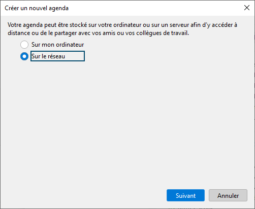
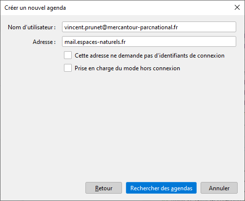
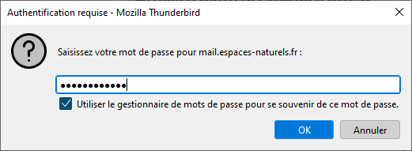
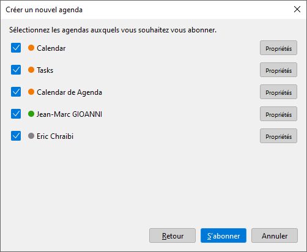
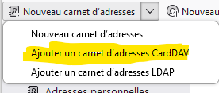
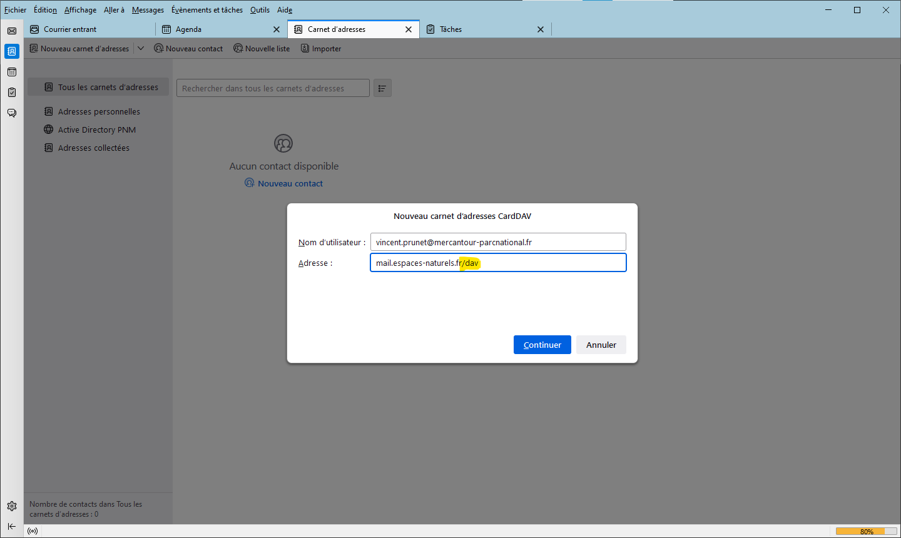
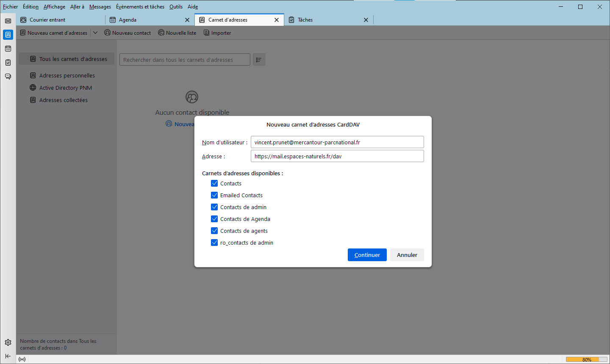

# Thunderbird

Ce document explique comment configurer l'application Thunderbird (version 102) pour accéder à vos dossiers (mail, agenda, contacts) personnels ainsi qu'aux dossiers partagés avec vous.  
Avant de commencer, configurez les partages dans l'application web [Zimbra](../Zimbra/README.md).

Avec Thunderbird, la configuration du [mail](#mail), des [carnets d'adresse](#carnets-dadresses) et des [agendas](#agendas) sont réalisés indépendamment. Chacune de ces opérations peut être réalisée par le SI pendant une session de partage d'écran, ou par vous-mêmes si vous êtes familiers des outils de messagerie.

La configuration initiale de Thunderbird est réalisée par le SI sur votre PC ou sur votre compte itinérant Windows. L'ajout de [nouveaux agendas partagés](#agendas) lorsque de nouveaux collègues rejoignent le Parc est une opération simple que vous pourrez normalement réaliser vous-mêmes.

Bon à savoir, l'application interne http://agenda.mercantour.local vous donne accès à l'agenda de tous vos collègues, sous une forme expurgée, sans qu'il soit nécessaire d'importer leur agenda dans Thunderbird. Par ailleurs, lorsque vous créez un évènement dans Thunderbird, vous accédez automatiquement aux informations de disponibilité des collègues que vous invitez.

## Mail

### Configuration d'un nouveau PC

Si Thunderbird n'a pas encore été configuré sur votre session, contactez le SI ou, pour les utilisateurs avancés, configurez votre accès mail vous-mêmes :

La configuration des comptes mail est accessible par le menu `Edition / Paramètres des comptes`. Pour créer un nouveau compte, cliquez sur `Gestion des comptes / Ajouter un compte de messagerie` qui ouvre l'onglet `Configuration du compte`.  
Le raccourci `Fichier / Nouveau / Compte courrier existant ...` donne un accès direct à l'onglet `Configuration du compte`.

Une fois sur l'onglet `Configuration du compte`, cliquez sur `configuration manuelle`.

- Entrez votre nom complet
- Entrez votre adresse mail
- Entrez votre mot de passe de messagerie (Attention, ce n'est pas votre mot de passe Windows!)
- Paramètres serveur entrant : IMAP, nom d'hôte mail.espaces-naturels.fr, le nom d'utilisateur est votre adresse mail
- Paramètres serveur sortant : nom d'hôte mail.espaces-naturels.fr, le nom d'utilisateur est votre adresse mail

- Laissez tous les autres paramètres à leur valeur par défaut.

Paramétrez l'ajout automatique de [votre signature personnalisée](Signature.md) dans les messages envoyés.

Pour supprimer un compte **réseau** sur thunderbird (si vous savez ce que vous faites), sélectionnez le compte dans Gestion des comptes et cliquer sur Gestion des comptes / supprimer le compte. Cette opération supprime la connexion de thunderbird à Zimbra, vos messages sont conservés sur le serveur Zimbra et vos autres connexions au serveur ne sont pas affectées.

Attention à ne pas supprimer de dossier **local** à Thunderbird, car ces dossiers ne sont pas sauvegardés sur Zimbra.

### Mise à jour d'une configuration ancienne

Si votre PC a été configuré depuis plusieurs années, il est possible que Thunderbird utilise encore l'extension TBSync pour se connecter au serveur Zimbra avec le protocole ActiveSync (protocole propriétaire de Microsoft).  
Si c'est le cas, merci d'en informer le SI qui analysera et mettra à jour votre configuration.

## Agendas

Commencez par vous désabonner de tous les agendas **réseau** installés sur thunderbird par une autre procédure que celle décrite ci dessous. Ne conservez que les agendas **locaux** à l'ordinateur, si vous en avez.

Pour se désabonner d'un agenda, clic droit sur l'agenda et `se désabonner de l'agenda`.

### Installation d'un agenda personnel ou partagé

La création d'un agenda est accessible depuis l'onglet `agenda` (en cliquant sur le bouton `+` au dessus des agendas) ou via le raccourci `fichier / Nouveau / Agenda`

Sélectionnez l'option réseau.  

Entrez votre email et l'adresse du serveur mail.espaces-naturels.fr.  

Entrez votre mot passe zimbra.  

Une fenêtre apparaît avec la liste de vos agendas personnels ou partagés avec vous par d'autres utilisateurs et préalablement [acceptés](../Zimbra/README.md) dans l'appli web zimbra.  

Votre agenda principal s'appelle `calendar`.

L'agenda `Tasks` sert à gérer vos tâches (optionnel, mais utile). Attention, si cet agenda est masqué dans l'onglet agenda, les tâches n'apparaissent plus dans l'onglet Tâches (et réciproquement avec les autres agendas qui apparaissent dans l'onglet tâches).

Sélectionnez les agendas que vous souhaitez voir dans thunderbird.
L'édition des paramètres de l'agenda permet de régler le délai de synchronisation, de forcer une synchro, ou d'indiquer à Thunderbird que cet agenda doit être considéré comme étant en lecture seule (thunderbird ne sait pas déterminer si l'agenda zimbra est partagé en lecture ou en lecture écriture. En cochant la case, on s'interdit de modifier dans thunderbird l'agenda d'un autre et on évite des comportements bizarres lorsque l'agenda n'a pas été partagé en écriture sur le serveur).

Pour chaque agenda importé, cliquez sur "Propriétés" afin de le nommer, lui donner la couleur désirée.

Pour les agendas partagés, vous décocherez généralement `Afficher les alarmes`, vous cocherez `En lecture seule` et vous décocherez `Prise en charge du mode hors connexion` (votre PC ne s'en portera que mieux car il semble que Thunderbird consomme énormément de mémoire lorsque cette option est cochée).

L'opération peut être répétée, par exemple lorsqu'un nouveau collègue rejoint votre équipe et a partagé son agenda avec vous (n'oubliez pas de l'[accepter dans Zimbra](../Zimbra/README.md)). Dans ce cas seuls les agendas réseaux qui n'étaient pas déjà sélectionnés sont proposés.

### Gestion des évènements

Nous avons constaté des erreurs de synchronisation avec des agendas réseau contenant de nombreux évènements. Si cela vous arrive, vous pouvez faire le ménage ou archiver vos évènements passés. L'archivage peut être enregistré sur un agenda réseau secondaire que vous pouvez créer avec l'application web Zimbra(permettant ainsi de consulter ces évènements depuis n'importe quel terminal) ou sur l'agenda local (dans ce cas, il vous faudra ouvrir thunderbird pour accéder à votre archive).

Il semble également que les évènements récurrents dont certaines occurrences ont été éditées peuvent engendrer des erreurs sur Thunderbird.  
Evitez donc, autant que possible, de définir des évènements récurrents ou de modifier les occurrences d'évènements récurrents.

## Carnets d'adresses

Pour vous connecter à un carnet d'adresses réseau, ouvrez l'onglet `Carnet d'adresses`, cliquez sur la flèche à droite de `Nouveau carnet d'adresses` et sélectionner CARDDAV dans le menu déroulant).  

Entrez votre adresse mail et l'url du serveur Zimbra https://espaces-naturels.fr/dav (ne pas oublier dav, par contre l'entête https est optionnel, comme pour les agendas).  

Entrez votre mot passe zimbra.  

Sélectionnez les carnets d'adresse à importer.  

Votre carnet d'adresses principal s'appelle `Contacts`, zimbra gère automatiquement le carnet d'adresses `Emailed Contacts` en inspectant les mails reçus et envoyés.  
D'autres carnets d'adresses peuvent être proposés s'ils ont été partagés par leur propriétaire et [acceptés](../Zimbra/README.md) dans l'appli web zimbra.

L'édition des paramètres du carnet d'adresses permet de régler le délai de synchronisation, de forcer une synchronisation, ou d'indiquer à Thunderbird que ce carnet doit être considéré comme étant en lecture seule (Thunderbird ne sait pas déterminer si le carnet zimbra est partagé en lecture ou en lecture écriture. En cochant la case, on s'interdit de modifier le carnet dans thunderbird et on évite des comportements bizarres lorsque le carnet n'est pas inscriptible sur le serveur).

### Annuaire LDAP

Il est possible de connecter le client Thunderbird à un annuaire LDAP. Ci-dessous la procédure de connexion à l'annuaire de l'active directory PNM qui est notre base de données de référence pour les données de contact des utilisateurs internes.

En principe, le carnet d'adresses partagé de `agents@mercantour-parcnational.fr` doit vous proposer les mêmes données. Cette connexion n'est donc utile dans la pratique que pour voir des données mises à jour très récemment.

Il faut bien entendu être sur le réseau interne ou le VPN pour accéder à ce serveur.

Nouveau carnet d'adresses (cliquer sur la flèche à droite et sélectionner LDAP dans le menu déroulant).

- Nom d'hôte: `dc1.mercantour.local`
- Nom distinct de base: `OU=utilisateurs,DC=mercantour,DC=local`
- Numéro de port: `389`
- Connecter avec l'utilisateur: `<login>@mercantour.local`

où `<login>` est votre login Windows.

Configuration avancée

- Etendue: Sous-arbre
- Filtre: `(&(objectclass=person)(mail=\*@mercantour-parcnational.fr))`
- Méthode d'identification: Kerberos(GSSAPI)

## Configuration et génération de la signature 

Pour configurer sa signature rendez-vous sur l'url suivante : [http://signature.mercantour.local/](http://signature.mercantour.local/)

Rédiger votre signature en remplissant correctement les cases à remplir et à supprimer les éléments non nécessaire. (numéro de téléphone portable si nul besoin est par exemple)
Cliquer ensuite sur "Générer la signature" et glisser le fichier téléchargé dans "Documents" trouvable dans "Explorateur de fichiers" de Windows.

Se rendre ensuite sur le compte thunderbird où l'on souhaite apporter une signature et naviguer vers "Outils" dans la barre d'outils se trouvant en haut d'écran, puis sur "Paramètres des comptes". Une fois à ce niveau sur la première page, sélectionner "Apposer la signature à partir d'un fichier", puis cliquer sur la case "Choisir" se trouvant directement à droite. Enfin, sélectionner la signature précedémment téléchargée.

En dernier lieu, se rendre à nouveau vers "Outils" dans la barre d'outils, puis sur "Paramètres". Ensuite, cliquer sur l'onglet "Vie privée et sécurité", cocher la case "Autoriser le contenu distant dans les messages" et cliquer sur "Exceptions". Renseigner dans "Adresse du site web" : *@mercantour-parcnational.fr puis "Autoriser", enfin, cliquer sur "Enregistrer les modifications".

