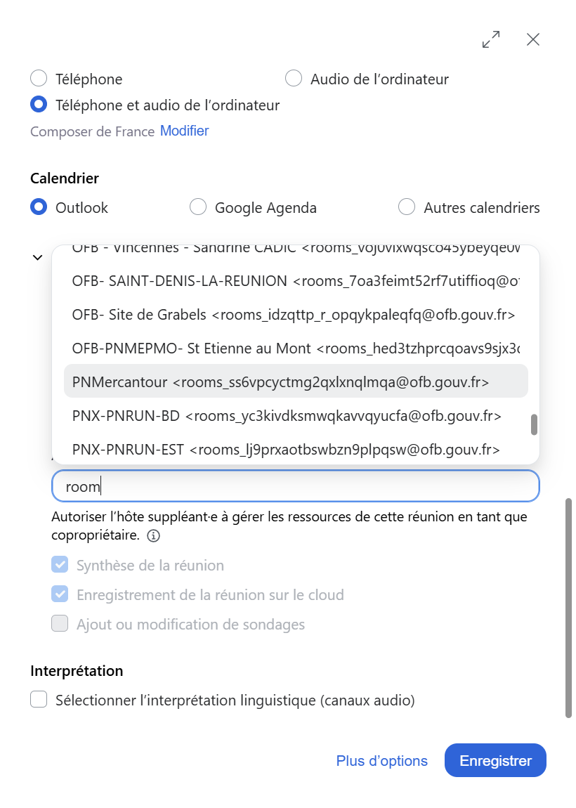

# Services Zoom

Les agents qui disposent d'un compte Zoom peuvent organiser des visio-conférences et utiliser les outils de communication intégrés dans l'application.

## Prérequis

L'application **Zoom Workplace** est en principe installée sur tous les ordinateurs du Parc. Si ce n'est pas le cas, vous pouvez utiliser [Zoom version web](https://app.zoom.us/wc) (voir [la documentation officielle](https://support.zoom.com/hc/fr/article?id=zm_kb&sysparm_article=KB0064261)) et contacter le SI pour demander l'installation de l'application.

!!! warning "Anticipez !"
    N'attendez pas la dernière minute pour nous appeler au sujet d'une réunion prévue de longue date. Vérifiez dès la planification de la réunion que Zoom fonctionne sur votre poste, et testez-le si besoin avec une [réunion de test](https://support.zoom.com/hc/fr/article?id=zm_kb&sysparm_article=KB0063307).

## Connexion
Après avoir lancé l'application Zoom, sélectionner l'option de connexion **SSO** et saisir `ofb-fr` comme domaine d'authentification. Un écran d'authentification s'ouvre alors, saisissez votre adresse e-mail et votre mot de passe Windows.

Pour créer une réunion directement depuis Outlook, [activez le plugin Zoom d'Outlook](./README.md#activer-le-plugin-zoom-doutlook).

## Créer une réunion

Vous devez être connecté à votre compte Zoom pour créer une réunion.

| Méthode | Quand l'utiliser | Documentation officielle |
|---|---|---|
| **Réunion instantanée** : bouton **Nouvelle réunion** de Zoom Workplace | Démarrer tout de suite une réunion | [Organiser une réunion instantanée](https://support.zoom.com/hc/fr/article?id=zm_kb&sysparm_article=KB0061787) |
| **Planifier depuis Zoom Workplace** : bouton **Planifier** | Fixer une date, une heure, des options (salle d'attente, mot de passe, etc.) | [Planifier des réunions](https://support.zoom.com/hc/fr/article?id=zm_kb&sysparm_article=KB0060714) |
| **Planifier depuis Outlook** : bouton **Zoom** (ou **Ajouter une réunion Zoom**) lors de la création d'un évènement | Inviter des collègues via l'agenda Outlook | [Plugin et add-in Outlook](https://support.zoom.com/hc/fr/article?id=zm_kb&sysparm_article=KB0060148), [Planifier avec l'add-in Outlook](https://support.zoom.com/hc/fr/article?id=zm_kb&sysparm_article=KB0083208) |
| **Réunion récurrente** | Réunion qui revient régulièrement (point d'équipe hebdomadaire…) | [Planifier une réunion récurrente](https://support.zoom.com/hc/fr/article?id=zm_kb&sysparm_article=KB0064260) |
| **Depuis un modèle** | Reproduire les mêmes réglages d'une réunion à l'autre | [Planifier une réunion à partir d'un modèle (article en anglais uniquement)](https://support.zoom.com/hc/en/article?id=zm_kb&sysparm_article=KB0067374) |
| **Depuis l'application mobile** | Organiser une réunion depuis un smartphone | [Zoom Workplace mobile](https://support.zoom.com/hc/fr/article?id=zm_kb&sysparm_article=KB0063596) |

Une fois la réunion créée, [invitez les participants](https://support.zoom.com/hc/fr/article?id=zm_kb&sysparm_article=KB0063703) en leur envoyant le lien ou l'invitation. Pour une réunion en salle équipée, voir [Déléguer l'animation à l'outil Poly](#deleguer-lanimation-zoom-a-loutil-de-visioconference-poly) ci-dessous.

Pour démarrer une réunion que vous avez planifiée : [démarrer ou rejoindre une réunion en tant qu'organisateur](https://support.zoom.com/hc/fr/article?id=zm_kb&sysparm_article=KB0061835).

## Participer à une réunion

Toutes les méthodes sont détaillées dans la [documentation officielle : Rejoindre une réunion Zoom](https://support.zoom.com/hc/fr/article?id=zm_kb&sysparm_article=KB0060747). Les principales :

- **Depuis le lien d'invitation** (e-mail, invitation Outlook, message) : cliquer sur le lien, [documentation](https://support.zoom.com/hc/fr/article?id=zm_kb&sysparm_article=KB0065191).
- **Depuis l'application Zoom Workplace** : bouton **Rejoindre**, puis saisir l'identifiant de réunion (et le code secret si demandé).
- **Depuis le site [zoom.us/join](https://zoom.us/join)** : saisir l'identifiant de réunion.
- **Depuis votre navigateur, sans installer d'application** : sur la page d'attente, cliquer sur **Rejoindre depuis votre navigateur**, [documentation](https://support.zoom.com/hc/fr/article?id=zm_kb&sysparm_article=KB0064274).
- **Sans compte Zoom** : il n'est pas nécessaire d'avoir un compte pour rejoindre une réunion, [documentation](https://support.zoom.com/hc/fr/article?id=zm_kb&sysparm_article=KB0059559).
- **Depuis l'application mobile** (smartphone ou tablette) : [documentation](https://support.zoom.com/hc/fr/article?id=zm_kb&sysparm_article=KB0063596).
- **Par téléphone** (audio seul) : composer l'un des numéros indiqués dans l'invitation, puis saisir l'identifiant de réunion. Vous pouvez aussi vous faire appeler depuis la réunion : [documentation](https://support.zoom.com/hc/fr/article?id=zm_kb&sysparm_article=KB0061690).

Avant une réunion importante, vous pouvez [tester votre installation](https://support.zoom.com/hc/fr/article?id=zm_kb&sysparm_article=KB0063322) sur la page de test de Zoom. En cas de difficulté, consultez [Que faire quand on ne peut pas rejoindre une réunion](https://support.zoom.com/hc/fr/article?id=zm_kb&sysparm_article=KB0068751).

## Déléguer l'animation Zoom à l'outil de visioconférence Poly

Si vous avez planifié une réunion Zoom mais que vous ne pourrez pas y assister, physiquement ou à distance, vous pouvez désigner une autre personne qui pourra la démarrer et l'animer à votre place dans Zoom.  

Si cette visio était prévue en salle équipée de l'outil Poly, alors n'importe qui pourra lancer et animer la réunion en salle depuis l'outil, en suivant la procédure suivante avant votre absence :  

- Lors de la planification (ou en modifiant une réunion existante), descendez jusqu'à trouver **Avancé**, dépliez l'onglet.

- Dans le champ **Autre animateur possible**, recherchez l'identifiant `PNMercantour` (le mot clé `room` peut fonctionner aussi, en scrollant vers le bas jusqu'à PNMercantour).
- Enregistrez la réunion.
- Vous verrez la réunion Zoom apparaître sur l'outil en salle de réunion le jour J.

Cette procédure s'applique également à un·e collègue en ajoutant son adresse mail aux "autres animateurs possibles". Mais celui-ci disposera uniquement des droits pour animer la réunion, elle n'apparaîtra pas dans l'outil de visioconférence Poly.

