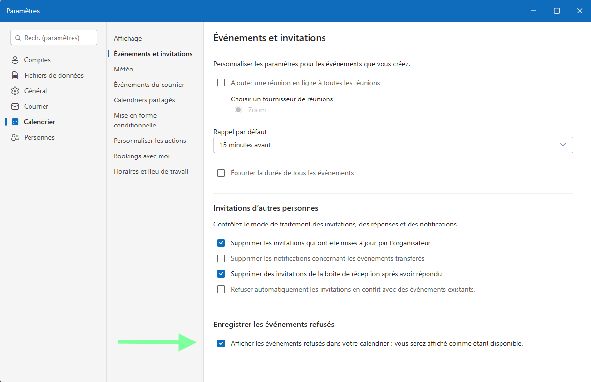
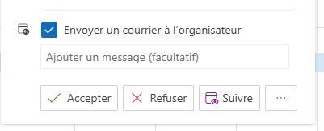

# Outlook : Afficher les événements refusés et suivre une réunion

## Afficher les événements refusés dans votre calendrier

L’option « Afficher les événements refusés dans votre calendrier » permet de conserver la visibilité des invitations que vous avez refusées. Les rendez-vous refusés restent affichés dans votre calendrier, ce qui vous permet de garder une vue complète de votre planning et d’éviter les conflits ou oublis liés à des réunions déclinées.

## Fonction « Suivre » dans Outlook

La fonctionnalité « Suivre » permet de recevoir des notifications et de rester informé des échanges liés à un message ou une conversation importante. En suivant un élément, vous pouvez facilement retrouver les informations associées et ne manquer aucune mise à jour ou réponse importante.

