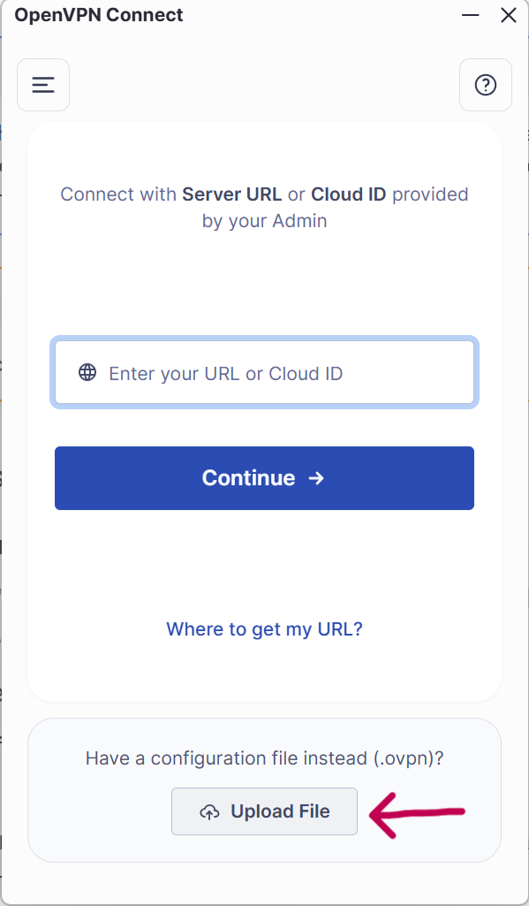
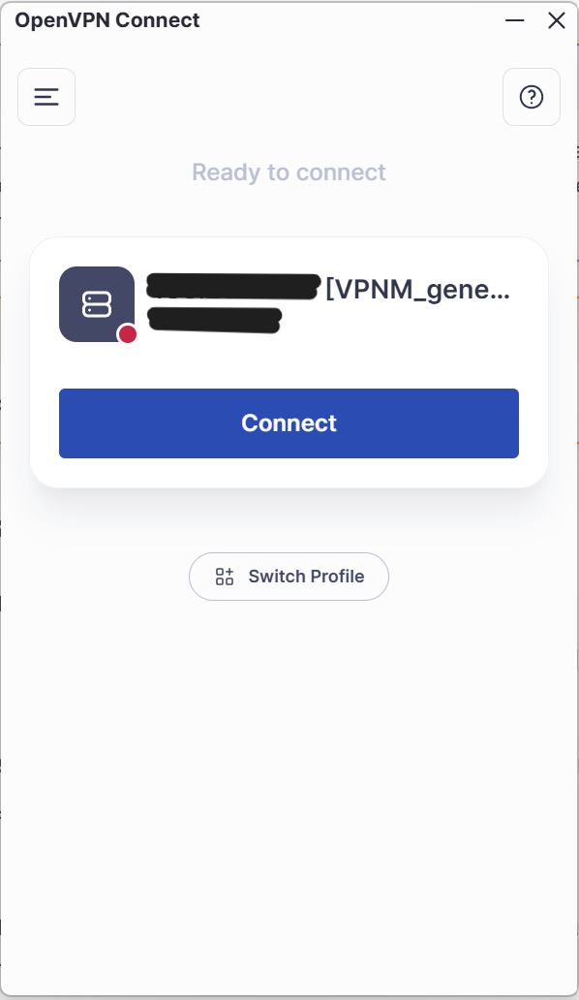

# Connexion via VPN

## À quoi sert le VPN ?

Le VPN permet de relier votre ordinateur au réseau informatique du Parc lorsque vous êtes en dehors des locaux. Il crée une connexion protégée par Internet, un peu comme si votre ordinateur était branché au réseau du Parc.

Une fois connecté, vous pouvez accéder à certains services internes qui ne sont pas disponibles depuis une connexion Internet classique, par exemple des serveurs de fichiers, des applications du Parc, de l'OFB (Virtualia, ...) ou ministérielles. Le VPN ne remplace pas votre connexion Internet, il s'appuie dessus.

L'accès nécessite une autorisation et une configuration fournies par le SI. Le VPN ne donne accès qu'aux ressources auxquelles votre compte est autorisé.

Le VPN peut aussi être installé sur votre mobile professionnel. Une seule connexion est autorisée à la fois : vous ne pouvez donc pas être connecté au VPN sur votre mobile et sur votre PC en même temps.

## Se connecter avec OpenVPN Connect

### Avant de commencer

- Vous devez disposer d'une connexion Internet.
- Demandez au SI le profil de connexion VPN, un fichier se terminant généralement par `.ovpn`. 
- Vérifiez que vous l'application OpenVPNConnect est bien installée sur votre PC, sinon demandez l'installation au SI.

!!! note "Tester le VPN depuis le bureau"
	Une règle de pare-feu empêche d'établir une connexion VPN depuis le réseau local du Parc. Le VPN ne peut donc pas être testé depuis le Wi-Fi ou le réseau filaire du bureau. Pour le tester sur place, connectez votre ordinateur au partage de connexion de votre smartphone, puis lancez OpenVPN Connect.

!!! warning "Rappel" 
	Pour toute demande au SI, écrivez à [si@mercantour-parcnational.fr](mailto:si@mercantour-parcnational.fr)

### Importer le profil et se connecter

1. Ouvrez **OpenVPN Connect**.
2. Choisissez l'option d'importation d'un profil depuis un fichier. Selon la version, elle peut s'appeler **Upload File** ou **Importer un profil**.

	{ width="300" }

3. Sélectionnez le fichier `.ovpn` reçu du SI, puis confirmez l'importation.
4. Dans la liste des profils, appuyez ou cliquez sur **Connect** (ou activez l'interrupteur de connexion).

	{ width="300" }

5. Si l'application demande un nom d'utilisateur et un mot de passe, saisissez ceux que vous utilisez généralement pour vous connecter à votre session (adresse mail + mot de passe Windows).
6. Attendez que l'application indique que la connexion est établie.

Pour vous déconnecter, ouvrez OpenVPN Connect et choisissez **Disconnect**.

### En cas de problème

Vérifiez d'abord que votre connexion Internet fonctionne. Si le profil manque, si vos identifiants sont refusés ou si la connexion échoue, contactez le SI en précisant le message affiché.

