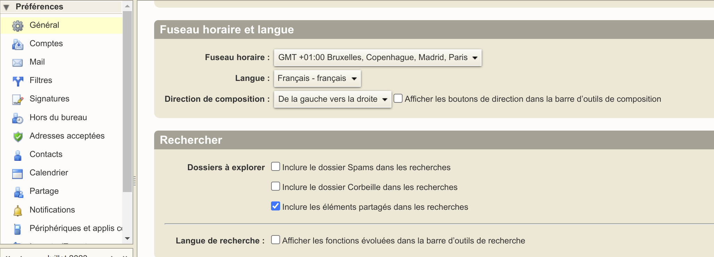
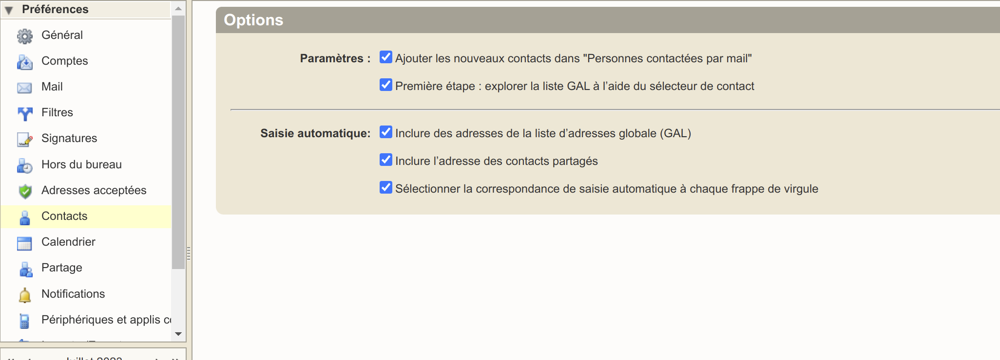
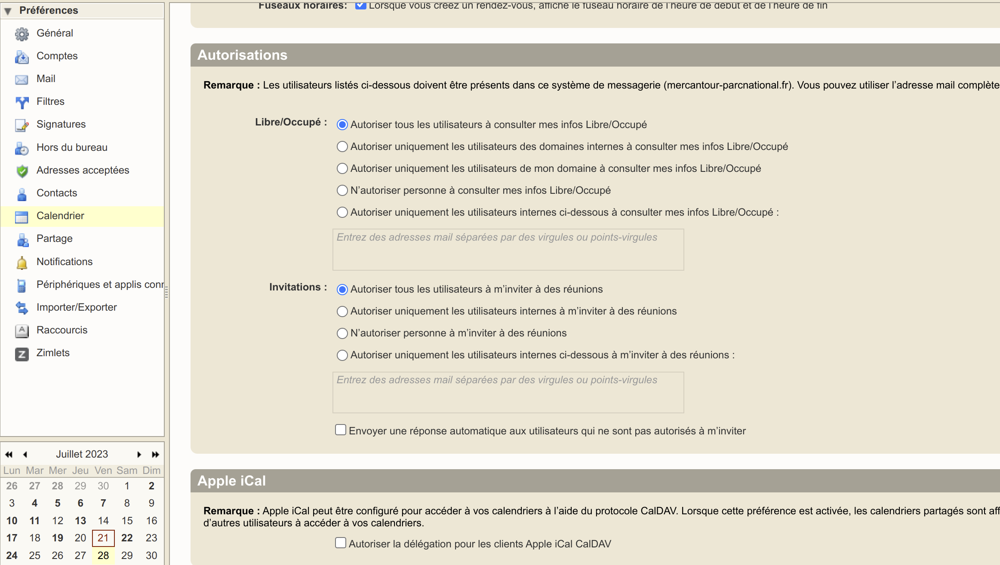

# Zimbra

Notre serveur de messagerie Zimbra permet de partager les agendas, les carnets d'adresses et les boîtes mail, collectivement appelés `dossiers` par Zimbra.  
Ce document explique comment [partager vos dossiers](#partager-son-agenda-son-carnet-dadresses-sa-boîte-mail) et comment [accéder aux dossiers partagés par un collègue](#accéder-à-un-agenda-un-carnet-dadresses-ou-une-boîte-mail-partagés-avec-moi).

Après avoir configuré Zimbra, vous pourrez simplement accéder aux partages depuis Thunderbird et les applications de messagerie/contacts/agenda de votre smartphone.

- Paramétrer [Thunderbird](../Thunderbird/README.md).
- Paramétrer votre [smartphone android](../android/README.md).

## Création du compte Zimbra et configuration générale

Votre compte Zimbra ne peut être créé que par un administrateur du SI.  
C'est aussi l'administrateur de la messagerie qui crée les listes de diffusion, mais il peut ensuite vous en confier la gestion (ajout, suppression, filtrage). Les listes de diffusion auxquelles vous avez accès apparaissent sous l'onglet contact.

Muni de votre identifiant (votre adresse email) et de votre mot de passe Zimbra, connectez-vous à l'application web zimbra pour recevoir et envoyer des messages, gérer les listes de diffusion, gérer et partager vos carnets d'adresse et vos agendas.  
Ayez le réflexe zimbra web, lorsque vous n'avez pas accès à votre application PC (thunderbird) ou à une application mobile.

Il est important de vérifier que les bonnes options sont cochées dans les préférences de l'application web zimbra

### Préférences générales

Cocher la case _Inclure les éléments partagés dans les recherches_.

### Préférences des contacts

Cocher les cases _Première étape: explorer la liste GAL_ et _Inclure des adresses de la liste d'adresses globales_. Cette option vous aide à trouver l'adresse de votre correspondant (ou liste) sur le serveur Zimbra en tapant les premières lettres du nom.

Cocher la case _Inclure l'adresse des contacts partagés_ pour que la saisie automatique utilise les [carnets d'adresses partagés avec vous](#accéder-à-un-agenda-un-carnet-dadresses-ou-une-boîte-mail-partagés-avec-moi).

### Préférences du calendrier

Cocher la case _Autoriser tous les utilisateurs à consulter mes infos Libre/Occupé_. Cette fonction est utilisée par les planificateurs de réunions (sans donner accès aux données de l'évènement).

Décocher impérativement la case _Autoriser la délégation pour les clients Apple Ical Caldav_ sinon vous ne verrez pas vos agendas dans thunderbird.

En général, vous cocherez également la case _Autoriser tous les utilisateurs à m'inviter à des réunions_.

## Partager son agenda, son carnet d'adresses, sa boîte mail

Vous pouvez configurer le partage avec d'autres utilisateurs (ou listes d'utilisateurs) zimbra de votre boîte mail, de votre agenda ou de votre carnet d'adresses.

Le paramétrage des partages doit être réalisé dans l'appli web zimbra https://mail.espaces-naturels.fr/ :

- dans l'onglet `Préférences / Partage`,
- ou dans l'onglet `Mail, Contacts, Calendrier` en sélectionnant (clic droit) le calendrier, le carnet d'adresses ou le dossier de mail à partager.

### Gérer les partages actifs

L'onglet `Préférences / Partage / Dossiers partagés par moi` vous permet de contrôler les partages actifs, de modifier les droits ou de révoquer un partage.

### Partage à activer impérativement

Il est **nécessaire** de partager votre agenda avec agenda@mercantour-parcnational.fr en lui donnant le rôle de visionneur. Ce partage permet à l'application http://agenda.mercantour.local (sur le réseau interne) d'accéder à votre agenda et de le visualiser sous une forme expurgée (le titre des évènements publics est révélé, le détail des évènements reste masqué). Vos rendez-vous privés sont entièrement masqués.

### Partages optionnels

Vous pouvez partager votre agenda avec des utilisateurs identifiés, avec des groupes d'utilisateurs (par exemple la liste de diffusion de votre service) ou avec tous les collègues (partage avec la liste de diffusion générale mercantour@mercantour-parcnational.fr ).  
Vous pouvez également partager un carnet d'adresses ou une boîte mail en suivant la même procédure.

Pour chaque partage, vous devez préciser le rôle attribué au collègue avec qui vous partagez vos dossiers: visionneur ou gestionnaire.
Ces partages ciblés vont permettre à vos collègues d'accéder de façon sécurisée en se connectant avec leur identifiant (et leur mot de passe) à vos dossiers depuis n'importe laquelle de leurs applications de messagerie/agenda/carnet d'adresses : zimbra web, thunderbird sur PC, mail, contacts et agenda sur smartphone.

### Partages à désactiver impérativement

**Supprimer les partages avec public**. N'importe qui sur Internet pourrait voir vos agendas, la liste de vos interlocuteurs, les mots de passe de connexion aux visioconférences, les informations confidentielles contenues dans les évènements.

## Accéder à un agenda, un carnet d'adresses ou une boîte mail partagés avec moi

Un collègue a partagé avec vous son agenda, son carnet d'adresses ou sa boîte mail.  
Voici comment y accéder.

Vous **devez** accepter le partage dans l'appli web zimbra https://mail.espaces-naturels.fr/ pour que ce partage soit détecté par vos applications de messagerie/calendrier/carnet d'adresses et soit visible également dans les pages mail/contacts et agenda de Zimbra Web.  
Si vous n'acceptez pas le partage, il n'apparaîtra sur votre application de messagerie/calendrier/carnet d'adresses que si vous saisissez l'URL correspondant au partage (c'est beaucoup plus compliqué).

### Accepter un partage depuis l'onglet Préférences

Ouvrez l'onglet `Préférences / Partage` ou vous trouverez la section `Dossiers partagés avec moi mais que je n'ai pas encore acceptés` et celle des `Dossiers partagés et déjà acceptés`

Vous verrez les dossiers partagés avec vous `dans le cadre d'une liste de distribution`.

- N'acceptez que les dossiers que vous voulez voir apparaître dans zimbra et sur votre mobile, c'est dire ceux des collègues avec lesquels vous interagissez très régulièrement.
- Pensez que l'application http://agenda.mercantour.local vous permet de consulter occasionnellement les autres agendas.
- Pensez également que thunderbird intègre un outil de planification de réunion qui connaît la disponibilité de chaque agent.

Vous verrez également les `dossiers partagés avec vous par un utilisateur spécifique` en utilisant le formulaire de recherche (entrez le nom de votre collègue). En toute logique, vous accepterez ce partage.

La section des `Dossiers partagés et déjà acceptés` vous permet de visualiser l'ensemble des dossiers partagés ajoutés à votre compte Zimbra. Pour renoncer à un partage déjà accepté et qui ne vous intéresse plus, voir [ci-dessous](#accepter-un-partage-depuis-longlet-calendrier-mail-contacts).

### Accepter ou renoncer à un partage depuis l'onglet Calendrier, Mail, Contacts

Vous pouvez également rechercher un partage à partir de l'onglet `Mail, Contacts, Calendrier` en cliquant sur la petite roue des options en haut à gauche de la liste des dossiers, puis `Rechercher des partages`.

Pour ne plus voir un dossier partagé avec vous, il suffit de faire un clic droit sur le dossier et de cliquer sur Supprimer.

### Partages utiles

Il est important d'accepter l'invitation de partage du carnet d'adresses `Contacts` de `agents@mercantour-parcnational.fr`. Ce carnet d'adresses géré par le SI contient les contacts de l'ensemble des agents, il vous servira en particulier à déterminer qui vous appelle sur votre mobile et à compléter automatiquement les adresses de vos destinataires (une fonctionnalité qui existait avec Exchange, mais limitée à la liste d'adresses globale de Zimbra, excluant les carnets d'adresse partagés).

Vous pouvez également importer l'agenda commun du Parc, partagé par `agenda@mercantour-parcnational.fr`.

Certains services ont mis en place des agendas partagés, des carnets d'adresse partagés de contacts externes, usez et abusez de ces sources d'information.
